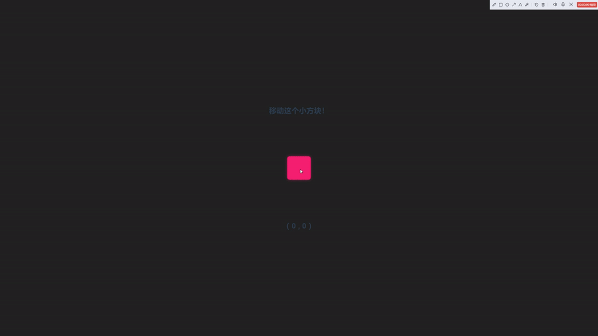
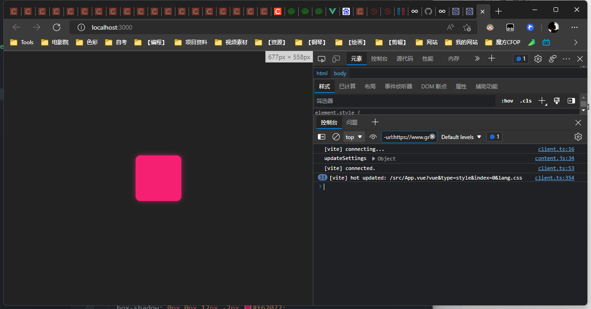
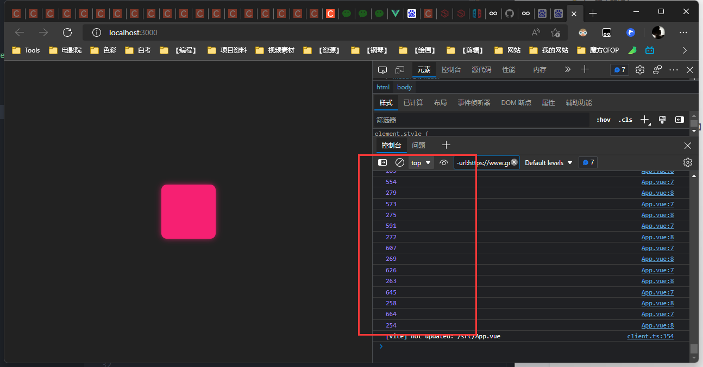
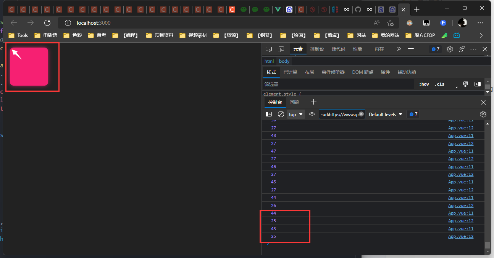
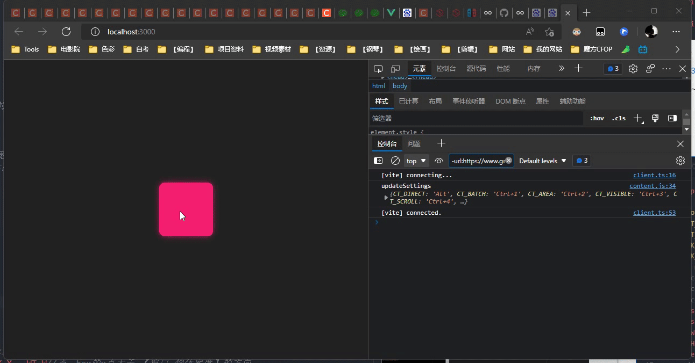
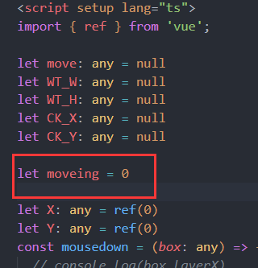
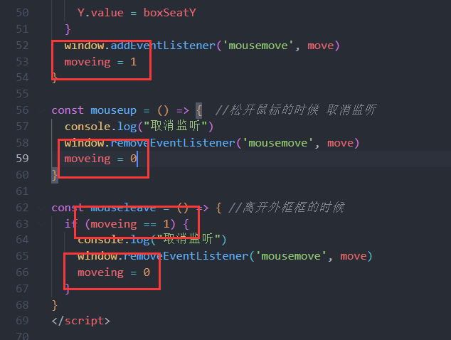
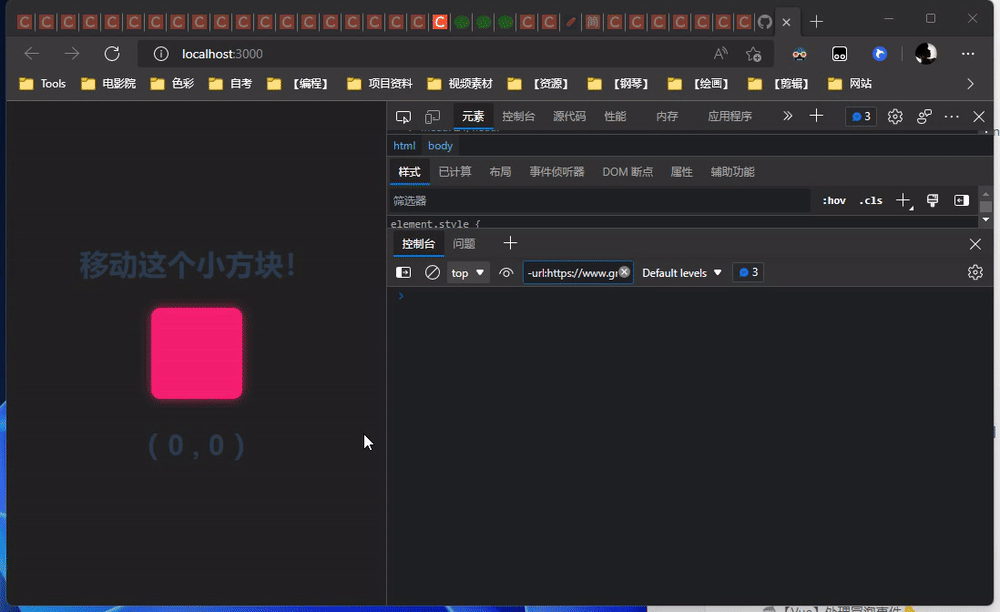

# XG-DEMO-FollowMouseMove

【演示】- JavaScript / Vue3 - 跟随鼠标移动

## 🟥🟧🟨🟩🟦🟪🟫⬛⬜

## 🟥1、先来一个小方块！
css样式自己定，长宽都100px 然后给个颜色！
```html
<div id="box" class="box btf"></div>
```

## 🟧2、监听鼠标的移动！
```vue
//vue3中
<script setup lang="ts">
  const move = (e:any) =>{
    console.log(e.clientX)
    console.log(e.clientY)
  }
  
  window.addEventListener('mousemove',move)
</script>
```

## 🟨3、【尝试】物体跟随鼠标
```javascript
//vue3中
import { onMounted } from 'vue';
onMounted(() => { //当div加载完以后再去得到dom元素👇
    let box: any = document.getElementById("box"); //1、得到dom

    const move = (e: any) => {  //3、这个方法就是得到鼠标移动的位置后，设置dom的位置！
        console.log(e.clientX)
        console.log(e.clientY)
        let left = e.clientX
        let top = e.clientY
        box.style.left = left + "px"; 
        box.style.top = top + "px";
    }
    window.addEventListener('mousemove',move)//2、监听鼠标移动，并设于方法
})
```

## 🟩4、【鼠标点击后】物体跟随鼠标移动！
```vue
<template>
  <div id="box" class="box btf" @mousedown="mousedown" @mouseup="mouseup"></div>
</template>

<script setup lang="ts">
	import { onMounted } from 'vue';

	//获得dom
	let box:any = null
	onMounted(() => {
		box = document.getElementById("box");
	})
	
	//定义监听 变量 【方便取消监听】
	let move:any = null
	
	//在鼠标点下的时候【监听鼠标，并且改变dom元素】
	const mousedown = () => { 
		move = (e: any) => {
			console.log(e.clientX)
			console.log(e.clientY)
			let left = e.clientX
			let top = e.clientY
			box.style.left = left + "px";
			box.style.top = top + "px";
		}
		window.addEventListener('mousemove',move)
	}
	
	//松开鼠标的时候 取消监听
	const mouseup =()=>{  
		window.removeEventListener('mousemove',move)
	}
</script>
```
## 🟦优化👇
#### 1、鼠标左键才可以移动 `@mousedown.left="mousedown" `
#### 2、【event.target】触发该事件的 DOM 元素。👇
```vue
<template>
  <div id="box" class="box btf" @mousedown.left="mousedown" @mouseup="mouseup"></div>
</template>

<script setup lang="ts">

let move: any = null
const mousedown = (box: any) => { //在鼠标点下的时候抓紧 移动
  console.log(box.target)
  move = (e: any) => {
    console.log(e.clientX)
    console.log(e.clientY)
    let left = e.clientX
    let top = e.clientY
    box.target.style.left = left + "px";
    box.target.style.top = top + "px";
  }
  window.addEventListener('mousemove', move)
}

const mouseup = () => {  //松开鼠标的时候 取消监听
console.log('xxg')
  window.removeEventListener('mousemove', move)
}
</script>
```
#### 3、定位鼠标在方块点击处【layerX】【layerY】
```vue
<template>
<div id="box" class="box btf" @mousedown.left="mousedown" @mouseup="mouseup"></div>
</template>

<script setup lang="ts">
	
	let move: any = null
	const mousedown = (box: any) => { //在鼠标点下的时候抓紧 移动
		console.log(box.layerX)
		console.log(box.layerY)
		console.log(box.target)
		move = (e: any) => {
			console.log(e.clientX)
			console.log(e.clientY)
			let left = e.clientX
			let top = e.clientY
			box.target.style.left = left - box.layerX + "px";
			box.target.style.top = top - box.layerY + "px";
		}
		window.addEventListener('mousemove', move)
	}
	
	const mouseup = () => {  //松开鼠标的时候 取消监听
		window.removeEventListener('mousemove', move)
	}
</script>
```
#### 4、改变光标👇
[https://www.w3school.com.cn/tiy/t.asp?f=eg_csse_cursor](https://www.w3school.com.cn/tiy/t.asp?f=eg_csse_cursor)
#### 5、当移动到边界~
```vue
<script setup lang="ts">

let move: any = null
let WT_W: any = null
let WT_H: any = null
let CK_X: any = null
let CK_Y: any = null
const mousedown = (box: any) => { //在鼠标点下的时候抓紧 移动
  // console.log(box.layerX)
  // console.log(box.layerY)
  // console.log(box.target)
  console.log(box.target.clientWidth) //【物体宽度w】
  console.log(box.target.clientHeight) //【物体高度h】
  WT_W = box.target.clientWidth
  WT_H = box.target.clientWidth
  move = (e: any) => {
    // console.log(e.clientX)
    // console.log(e.clientY)
    // console.log(e)
    console.log(e.view.innerWidth) //【窗口x】
    console.log(e.view.innerHeight)//【窗口y】
    CK_X = e.view.innerWidth
    CK_Y = e.view.innerHeight
    let left = e.clientX
    let top = e.clientY
    let boxSeatX = left - box.layerX
    let boxSeatY = top - box.layerY
    if (boxSeatX < 0) boxSeatX = 0 //当：box的x点小于窗口的 横方向x 
    if (boxSeatX > (CK_X - WT_W)) boxSeatX = CK_X - WT_W//当：box的x点大于 【窗口-物体宽度】的方向 
    if (boxSeatY < 0) boxSeatY = 0
    if (boxSeatY > (CK_Y - WT_H)) boxSeatY = CK_Y - WT_H//当：box的x点大于 【窗口-物体宽度】的方向 
    box.target.style.left = boxSeatX + "px";
    box.target.style.top = boxSeatY + "px";
  }
  window.addEventListener('mousemove', move)
}

const mouseup = () => {  //松开鼠标的时候 取消监听
  window.removeEventListener('mousemove', move)
}
</script>
```

#### 6、还有一个问题!
当鼠标移出了浏览器窗口后【再回来】无法触发【取消监听】这个方块就会一直粘着鼠标....👇在外框加一个移出【@mouseleave】也就是原生JavaScript里的【onmouseleave()】
```vue
<template>
<div class="area" @mouseleave="mouseleave">
	<h1>移动这个小方块！</h1>
	<div id="box" class="box btf" @mousedown.left="mousedown" @mouseup="mouseup"></div>
	<h1>（ {{ X }} , {{ Y }} ）</h1>
	</div>
</template>
```
```vue
<script setup lang="ts">
//...刚刚前面写的那些！

const mouseup = () => {  //松开鼠标的时候 取消监听
  console.log("取消监听")
  window.removeEventListener('mousemove', move)
}

const mouseleave = () => { //离开外框框的时候
  console.log("取消监听")
  window.removeEventListener('mousemove', move)
}
</script>
```
但是即使鼠标没去抓那个小方块，【只要鼠标离开了】它也会去取消监听.... 所以...👇再优化一下下


完成！！

#### 7、当重置窗口的时候 让小方块回到原来的位置！
```javascript
window.onresize = function () {
	console.log("窗口变化了！")
	mouseleave();
	let box: any = document.getElementById("box");
	box.style.left = "calc(50% - 50px)";
	box.style.top =  "calc(50% - 50px)";
}
```
## 🟪【END】
